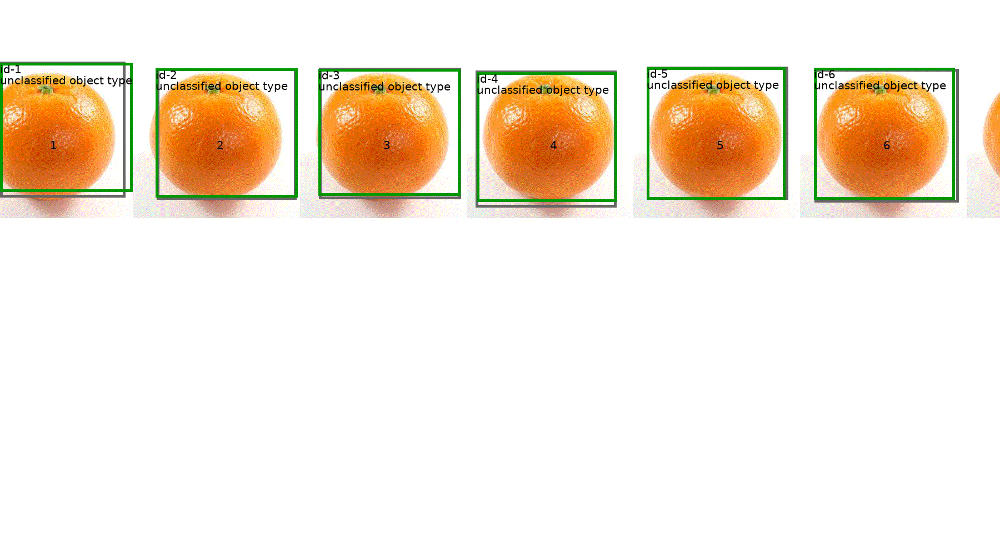

## Example Directory

This directory contains simulations of the SORT algorithm. The examples were initially generated one by one as part of testing the implementation and understanding what modifying various parameters does. The purpose of this page is to illustrate the various parameters and considerations one might need to take when using the SORT algorithm.

To run an example, `cd` into this directory and in the terminal run:

```
python exampleN.py
```
where `N` is the number of the example you would like to run. Examples will create `.gif`s or `png`s. Below the examples and their output is explained in detail.

If you are looking to start using the SORT algorithm in your application, go to the root of repository for the basics. The code in the examples here is dependent on a somewhat twisted process of generating gifs and generating the test data for the algorithm to run on based on `commonExample.py` and `generate.py`. The code in `exampleN.py` was written to be succicnt and easily modifiable by one looking to explore the algorithm.
 

### Examples in detail

 - **`example1.py`** -> in this basic example we demonstrate the SORT tracker working on an line of oranges moving from left to right. This example can be thought of as simulation of the SORT algorithm employed at a conveyer belt for oranges. The grey box is the measurement box which can be thought of as the output of an image detection algorithm. The image detection analyses each frame of a video and for each frame outputs a grey bounding box around a detected object. In this repository, we do not implement an image detection algorithm and thus have to simulate one.

   

   The `red` boxes represents the _true_ location of the objects, while the grey is the detected object by the image detection algorithm. Based on the positioning of the red to the grey box, the detection is not perfect and is noisy. Examples exploring noise levels will be done in later examples. 

   The image detection will return boxes represented by `(x,y)` coordinates and their width and height and finally their type. For now, each grey measurement box will be labeled as unidentitified as its type does not matter since all the objects (oranges) are the same. Later we will deal with example with various object types.

   When running

   ```
   python example1.py
   ```
 
   output will be created in `example1.gif`. Each frame of the `gif` will look something like this:

   

   The green boxes represents the current estimated location of an object provided by the SORT algorithm. This estimated location is marked with a name/ID (say `id-1`) and the object type (in this case unidentified). The grey is the measurement. A good tracking algorithm is able to map an ID to the same object through time -> that is the whole point of tracking!

   In this example the oranges move from right to left.

   Due to the looping nature of gifs, the first frame and last frame of the gif do not perfectly match up.


   | First frame             |  Last Frame |
   |:-------------------------|:-------------------------|
   |  |  |
   

    The first few parts of the gif are here:

    
    

    If you look at the left hand side, where the oranges dissapears, you will see that the grey box (measurement) do not go out of bounds of the gif. This is supposed to represent when part of an object leaves the field of view of the camera. The image detection algorithm still can detect the object (but not perfectly). When too much of the object has left the view, the image detection algorithm no longer detects the object. The tracker, tracks the object withouth measurements by predicting where it could be using the update phase of the Kalman filter. After some time has expired, the SORT algorithm assumes the object has dissapeared and stops tracking it. Setting this time period before an object is stopped being tracked is discussed in a later example.


 - **`example2.py`** -> this example starts similarly to the previous example in that we have oranges travelling from right to left. When the oranges reach the left hand side, they switch direction and move back. This sudden change in velocity is to test the SORT algorithm's ability to be able to track an object when it suddenly changes directory.
 
    

 - **`example3.py`** -> in this example we have three oranges moving from right to left in a sinusoidal fashion. The amplitude is the same, but the frequency is different for each orange.
 
     
     
      We see that for a higher frequency (orange 1), the SORT has more challenge tracking the object.
      
     

 - **`example4.py`** -> in this example we explore with how noisy measurements effect our capability to track an object's true position. From top to bottom, the noise in the measurements is increasing. When there is a lot of noise, we have trouble tracking the object. The higher the noise, the more 'noisy' the measurement (grey box) is and distant from the true position. In the `gif` below, green boxes are the tracked objects while the grey are the measurements.

   

   By observing the `gif`, we can see that the more noisier the incoming measurements, the more difficult it is for SORT algorithm to track the object. In fact, the tracking of the bottom orange fails a few time as seen in image below:

   

   The measurements for the bottom orange are so noisy that the our algorithm 'loses site' of the measurement. The new incoming measurements happen to be far away from the existing tracked object (`id-4`,`id-5`) and thus the algorithm has to create a new tracked object (`id-6`). The other objects, `id-4` and `id-5` keep following through the predict's phase of the Kalman filter until they are dropped by SORT algorithm due not having enough measurements to justify tracking them (after a while the algorithm 'assumes' this object has permantently left field of view and stops tracking).

   The objective of the SORT algorithm is to track the true state of an object. In the figure below, let's say that the object we are trying to track is the green rectangle (A with B) -> this is the 'true' state of the object. Let us assume that our current estimate/tracked-position of the object is the rectangle in red (C with B).

   

   Our tracking gets better when the purple area gets bigger:

   

   We can quantify this is as the intersection of rectangle A and rectangle C all divided by the union of rectangle A and rectangle C. Scalar intersection over union, abbreviated as IOU, is used within SORT algorithhm, but can also be used as a cost function for assesing how well SORT algorithm tracks the true state of the object based on noisy measurements. 

   If IOU evaluates to 0, then rectangle A and rectangle C have no overlap. If IOU evaluates to 1, then rectangle A and C are completely overlapping. The closer IOU evaluates to 1 the better we are tracking our object. All possible values for IOU are between 0 and 1. Here is the IOU computed for the intersection of two rectangle:

   

   Let us use compute the IOU for the three oranges and their respective trackers:

   

   One can observe that as measurement noise increases, the tracker is less effective since the IOU decreases. This is important to consider in the case when the image detection algorithm used to generate the measurements in a real life application is poor. Some strategies for dealing with noisy measurements are discussed in example 8. 

 - **`example5.py`** -> In this example we have two objects that start being beside each other. Here we are testing two objects that are close together and that the tracker can correctly keep track of each one.
 
    

 - **`example6.py`** -> In this example we test two situations in one gif. In both bottom and top row, we have oranges moving over each other. In the top row, oranges are above the other oranges and fully obscure the view of the orange behind them meaning that the measurements (grey boxes) come from only the orange in front. In the bottom row the measurements are coming from the front and back oranges (although this is not accurately represented in the generated gif itself). The top or bottom scenario in real life would depend on what you are tracking and your object detection algorithm. 
 
     

 - **`example7.py`** -> in this example we have multiple object types.
 
      

 - **`example8.py`** -> in this example we conduct an experiment to compare the effect of increasing the noisiness of the measurement vs how we tune our SORT algorithm.
 
   

   In the bottom row, the measurement noise is low while in top row the measurement noise is high (grey boxes with respect to true location of true orange location in red boxes). In the right column, we tune our SORT algorithm to assume our measurements are _not as noisy_. In the left column, we tune our SORT algorithm to assume our measurements are _noisier_. The language in italics is translation of mathematics into intuitive terms -> such translations should be treated carefully.

   When using a Kalman filter, which the SORT algorithm relies upon, we assume two noises: process noise and sensor noise. If you assume more sensor noise, then the algorithm will _trust_ the measurements less. If you assume more process noise, then the algorithm will _trust_ the model less. The model for the Kalman filter is your assumption of how the object you are tracking will move. If you are tracking a ball being thrown then your model might be the projectile motion equations while if you were rolling a ball on the ground at a constant velocity you would use a simple linear equation. The process noise is to account for things you are unaware or cannot control -> for the case of throwing a ball, maybe there is some wind. If you cannot predict how the wind will blow and you know there will be a significant amount, then it is approprirate to increase the assumed process noise.

   This last paragraph is a crash course in Kalman filtering. For more details and good links for learning more about the Kalman filter go [here](https://github.com/mannyray/kalmanfilter).

   Going back to the gif, the table below describes each orange:

   |||
   |:-------------------------|:-------------------------|
   | High measurement noise + assuming measurements are noisy  | High measurement noise + assuming measurements are not noisy |
   | Low measurement noise + assuming measurements are noisy  | Low measurement noise + assuming measurements are not noisy |

   For fair comparison, the noise for each row is the same. The difference between the two rows, is that the noise is multiplied by a greater than one scalar. 

   Let us first compare the enties of the bottom row.

   | Low measurement noise + assuming measurements are noisy  |  Low measurement noise + assuming measurements are not noisy  |
   |:-------------------------|:-------------------------|
   |  |  |

   For both figures:

    - The jagged blue line shows the computed IOU between the true location of the orange and the tracker (green box).
    - The flat blue line is the average of the jagged blue line.
    - The red jagged line is the IOU between the measurement (grey box) and tracker (green box).
    - The flat red line is the average of the jagged red line.

   The blue line is what we use to verify the performance of our tracker. To see more about IOU please see example 4. The closer IOU is to 1, the better our tracker is performing. By looking at the blue line, we can observe that both trackers are performing well with average IOU above `.80`. The SORT algorithm that assumes measurements are noisy (bottom left in `gif`), performs better (based on average blue line) and in the `gif` has a more smoother tracking.


   We observe that for when we assume the measurement are not noisy, the IOU between the measurements and tracker is closer to 1 than for the other scenario (red line). This can be explained intuitively -> when we assume measurements are not as noisy, the tracker relies on them more which translates to the higher IOU for measurements and tracker.

   Now what happens when we assume the measurements not noisy and we compare when the measurements are/are-not actually noisy -> the rightmost column of the table (and `gif`).

   ||
   |:-------------------------|
   | High measurement noise + assuming measurements are not noisy |
   | Low measurement noise + assuming measurements are not noisy  |


   |  High measurement noise + assuming measurements are not noisy  | Low measurement noise + assuming measurements are not noisy  |
   |:-------------------------|:-------------------------|
   |  |  |
   
   When we increase the actual noise we can see that the tracker does a poorer job at tracking the true orange location (blue line). This is intuitively expected -> the noisier the measurements, the harder it can be for the tracker to track the true state of the object. We observe that for both of these figures, the tracker is closer to the measurement than the true state (red line vs blue line).

   Now let us consider what happens when you have noisy measurements and SORT algorithm assumes the measurements are noisy. Do you expect this to perform better than when you have noisy measurements and SORT algorithm does _not_ assume the measurements are noisy. This corresponds to the top row of the table (and `gif`). 

   | High measurement noise + assuming measurements are noisy  |  High measurement noise + assuming measurements are not noisy  |
   |:-------------------------|:-------------------------|
   |  |  |

   The SORT algorithm that assumed higher sensor noise perfomed better with noisy measurements (blue line). The tracking also appears smoother (see top left orange in `gif`). In fact, the SORT algorithm assuming more noise measurements has a lower decrease in tracking performance when the measurements were not as noisy compared to SORT assuming measurements are not noisy. 

   This example hopes to demonstrate the potential importance of tuning assumed process/sensor noise for the SORT algorithm. In the implementation, default values for process and sensor noise are provided. In some cases the user may want to tune these parameters to better suit their application and improve results.

 - **`example9.py`** -> in this example we conduct an experiment to compare the effect of choosing a different model.

   The default model used by the SORT algorithm intially assumes that there is zero velocity. When a new object is detected, it is assigned position of where it was detected and velocity of zero. In addtion, the object is assigned an initial covariance. The assumed model for the Kalman filter portion of the SORT algorithm is that the object's position is increased by velocity and the velocity is unchanged. Despite the initial assumed velocity being zero and the model assuming unchanging velocity, the incoming measurements' position will be able to influence the assumed velocity to reflect the object moving. 

   The default model can perform well, but if you want better accuracy it can be appropriate to use a custom model. In our example, the object we are tracking is moving in sinusoidal fashion. The default model operates as described above. Our custom model will assume that the object moves in a sinusoidal fashion which will match the object's motion.

   In the table below the left `gif` shows the tracker is better tracking the orange location (green box) than on the right. 

   | Custom model  | Default model | 
   |:-------------------------|:-------------------------|
   |  |  |

   Let's evaluate the IOU between the true location of object and the tracker (green box). See example 4 for more details on IOU.

    

   The custom model (red jagged line and its average horizontal line) performs better than the default model. In the `gif`, the poorer performance of the default model can be observed as the green tracker appearing laggy with respect to the actual location. 

   | Custom model frame 108 | Default model frame 108 | 
   |:-------------------------|:-------------------------|
   |  |  |

   Where would one use a custom model? In situations where you have more knowledge about the environment and more accuracy is desired. A possible situation for when you know more about the environment is where you have a camera facing a road and you are tracking cars. The camera could be situated such that the cars on the camera's screen appear as moving from top left corner to bottom right. Maybe outside of rush hour, the cars are moving at a faster pace. This information can be used to be create a custom model.

 - **`example10.py`** -> in this example we investigate modifying the minimum IOU value. For more information on IOU see example 4. 

   The minimum IOU value in the code is used for detecting new objects.

   **Detecting new objects:** For every update phase of the SORT algorithm, we go through all the incoming measurements and see if any of them could be related to a new object that is currently untracked. Every single measurement has an IOU computed against every object currently being tracked. If for a given measurement, all the computed IOUs (against every object currently being tracked) are less than the minimum IOU this means that this measurement must be a new object. In other words, if an incoming measurement is far enough from all currently tracked objects then this measurement is now considered a new object -> the 'far enough' is specified by the minimum IOU. The larger the minimum IOU, the closer the measurement can be to a prexisting tracked object before being considered to be a new object. 

   After we have identified which measurements are new, there are three resulting scenarios:

   1. More tracked objects than measurements -> the Hungarian algorithm will match the measurements to the most suiting tracked objects based on IOU. However, a few tracked objects will not be matched -> one measurement is matched to one tracked object. These objects will be considered as withouth having an updating measurement. If these same objects do not have a measurement update for a while, the SORT algorithm will consider these objects as stale and will stop tracking them.

   2. Same amount of tracked objects as measurements -> each measurement will be matched up to a tracked object through the use of the Hungarian algorithm. One of the edge cases that this does not account for is when one of the tracked objects is about to be discontinued since it is out of field of view and our algorithm is no longer receiving measurements for it. On another part of the screen a measurement is registered that belongs to a new object. The about to be discontinued tracked object will be matched to the new measurement (even if they are far away) due to Hungarian algorithm. For an example of this, please see `example6.py`.

   3. Less tracked objects than measurements -> this implies that there are new objects that we did not detect with our minimum IOU. The minimum IOU is in fact too small. An example of scenario is where two people are walking beside each other and the object detection algorithm outputs two measurements boxes for the two people but these boxes are heavily overlaping such that the IOU value is higher than minimum IOU. For this purpose there is code added that reruns **Detecting new objects** code but by constantly upping a local copy of the minimum IOU until the the amount of tracked objects equals the amount of measurements.


   It is important to note that these three scenarios are not mutually exclusive. For example it can be the case you have the same amount of tracked objects as measurements while two measurements are heavily overlapping and one of the tracked objects is stale. This is a weakness of the algorithm.


   In the example below we increase the minimum IOU value to `0.9`. The IOU value needs to be between `0` and `1`. The default value of minimum IOU is `0.001`. 


   

   The IOU computed for each incoming measurement (grey box) and tracked object is probably less than `0.9` -> which implies a new object detection. Each new object detection results new tracked objects. The default velocity for new tracked objects (green) is set to zero, which is why many many are not moving and after some time fade away as discussed in `example12.py`.

   The usefulness of our tracker with this value for minimum IOU, breaks down.
   

 - **`example11.py`** -> in this example we conduct an experiment on speed of tracking the shape of the object.

   

   As the oranges enter the frame, the simulated objected detecting algorithm outputs its detection using a grey box. As the orange comes into full view, the average size of the grey box gets bigger (width) wise. The tracker (in green) adjusts to this. An object's tracked height and width is kept track of using a weighted rolling average.

   ```
   current_height = weight_1 * previous_height + weight_2 * measured_height
   previous_height = current_height
   current_width = weight_1 * previous_width + weight_2 * measured_weight
   previous_width = current_width
   ```

   where the following holds

   ```
   weight_1 = 1.0 - weight_2
   0 <= weight_2 and weight_2 <= 1
   ```

   In this example we experiment in modifying `weight_2`. Top orange has `weight_2 = 0.1`, middle orange has `weight_2 = 0.5` and bottom orange has `weight_2 = 1`. `weight_2` multiplies `measured_height`, meaning that the closer `weight_2` is to `1` then the more closer our tracked object (green box) is closer to the current measurement's dimensions (grey box). For `weight_2 = 1`, the grey box and green box always overlap (measurement and tracking). A higher value of `weight_2` allows for closer matching to incoming measurements while lower weight of `weight_2` allows for less influence of incoming measurements when new measurements come in.
 
  One will observe that we are tracking the object based on the top left corner of the object and not the center of the object. This is not ideal and can be subject of future modification.

 - **`example12.py`** -> in this example we experiment with how long we track an object once measurement's stop coming in.

  

  From top to bottom, we have an increasing amount of time we keep track of the object before we stop tracking it. This is useful in the case when measurements are spotty.

  The objects drift upwards due to the filter's estimate of the velocity not being completely accurate -> this expected for a filter as it provides an _estimate_.

 - **`example13.py`** -> in this example we discuss variable time. 

  All of the examples above assume that there is a second between each frame (technically dimensionless so unit of time between each frame). The predict and update phase is run for every new incoming set of measurements and the assumed velocity is pixels per one unit of time.

  In a real time application, the measurement might be coming at inconsistent time gaps. One measurement comes after 43 ms and the following after another 50ms. 

  The unit of time will be seconds in this implementation. The default model function used in predict phase of Kalman filter:
  
  ```python
  def predictFunctionDefault(self,state,t):
     position = state[0:2]
     velocity = state[2:4]
     position_next = position + velocity
     velocity_next = velocity
     result = [position_next[0], position_next[1], velocity_next[0], velocity_next[1]]
     return np.array( result )

  ```

  simply adds the velocity onto the position in the line
  
  ```
  position_next = position + velocity
  ```

  To account for variable time, `velocity` is scaled by the time (`time_since_last_predict`) before Kalman filter's predict phase is called:

  ```python
  time_since_last_predict = time - self.trackedObjectsByType[key][i].last_predict

   ...

     state = np.array([self.trackedObjectsByType[key][i].position[0],self.trackedObjectsByType[key][i].position[1], 
         self.trackedObjectsByType[key][i].velocity[0]*time_since_last_predict,
         self.trackedObjectsByType[key][i].velocity[1]*time_since_last_predict])

  ```

  This scaling is important to keep in mind when implementing custom function and jacobian as done in `example9.py`.

  Below is the result when comparing what happens when tracking the orange, but recieving measurements with varying frequency. In the graph we plot the IOU between the estimate and true position.

  
